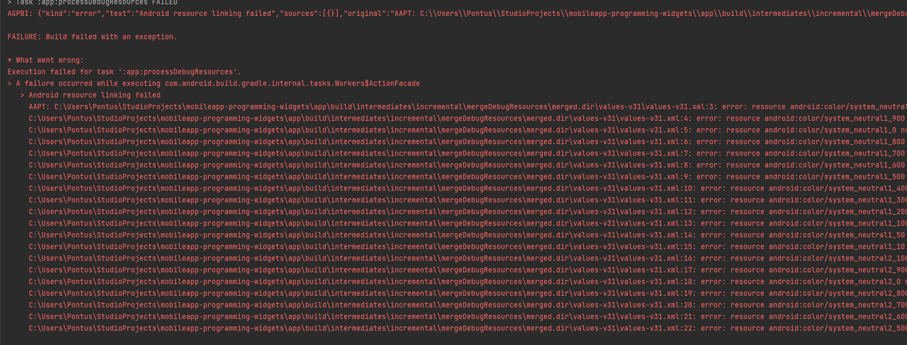

# Rapport


In this assignment we were able to decide whether we wanted to create a layout using ConstraintLayout or LinearLayout and I went with ContraintLayout. 
In activity_main.xml I have an ImageView, a EditText and a ButtonView.

Our ConstraintLayout contains of:
```
        android:layout_width="409dp"
        android:layout_height="354dp"
        tools:layout_editor_absoluteX="1dp"
        tools:layout_editor_absoluteY="188dp"
        tools:ignore="MissingConstraints">
```
Here we have decided out height and width as well as added ignore missingconstraints just for this.

And here is our ImageView,  tools:srcCompat="@tools:sample/avatars is a sample icon that came with the software.

```
        <ImageView
            android:id="@+id/imageView"
            android:layout_width="wrap_content"
            android:layout_height="wrap_content"
            tools:ignore="ImageContrastCheck"
            tools:layout_editor_absoluteX="140dp"
            tools:layout_editor_absoluteY="51dp"
            tools:srcCompat="@tools:sample/avatars"
            android:contentDescription="@string/icon" />
```

Here is my button: android:text="@string/button" can be found in values > strings.xml
```
        <Button
            android:id="@+id/button"
            android:layout_width="wrap_content"
            android:layout_height="wrap_content"
            android:text="@string/button"
            tools:layout_editor_absoluteX="162dp"
            tools:layout_editor_absoluteY="270dp" />
```

Resources in strings.xml so that it isn't hardcoded.
```
<resources>

    <string name="app_name">Widgets</string>
    <string name="name">Name</string>
    <string name="button">Button</string>
    <string name="icon">ICON</string>
</resources>
```

Last one is EditText

```
<EditText
            android:layout_width="207dp"
            android:layout_height="wrap_content"
            android:autofillHints=""
            android:inputType="Name"
            android:minHeight="48dp"
            android:text="@string/name"
            app:layout_constraintLeft_toLeftOf="parent"
            app:layout_constraintRight_toRightOf="parent"
            tools:layout_editor_absoluteY="200dp" />
```

However, as you can see from below this code doesn't seem to work, at least not on my PC and I'm not sure how to fix it.

```
Execution failed for task ':app:processDebugResources'.
> A failure occurred while executing com.android.build.gradle.internal.tasks.Workers$ActionFacade
```     


