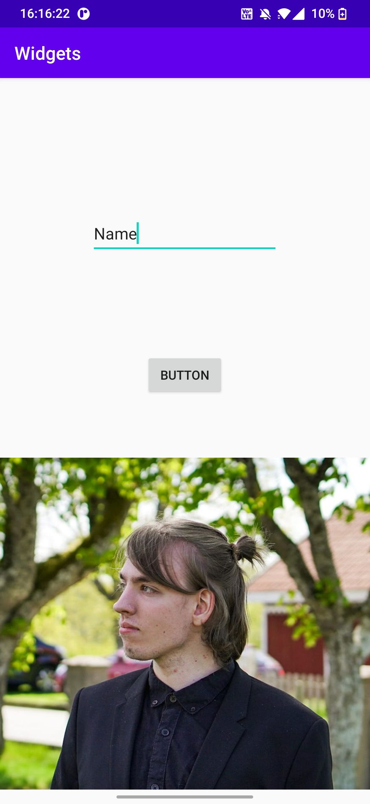

# Rapport


In this assignment we were able to decide whether we wanted to create a layout using ConstraintLayout or LinearLayout and I went with ContraintLayout. 
In activity_main.xml I have an ImageView, a ButtonView and a EditText.

Our ConstraintLayout contains of:
```
        <androidx.constraintlayout.widget.ConstraintLayout
        android:layout_width="wrap_content"
        android:layout_height="wrap_content"
        tools:ignore="MissingConstraints">
```
Here we have decided out height and width as well as added ignore missingconstraints just for this.

And here is our ImageView, the image is me.

```
<ImageView
            android:id="@+id/imageView"
            android:layout_width="wrap_content"
            android:layout_height="wrap_content"
            android:layout_marginTop="232dp"
            android:src="@drawable/jag"
            app:layout_constraintTop_toTopOf="parent"
            tools:srcCompat="@drawable/jag" />/>
```

Here is my button: android:text="@string/button" can be found in values > strings.xml
I use margins and constraints in order to set the placement.
```
        <Button
            android:id="@+id/button"
            android:layout_width="wrap_content"
            android:layout_height="wrap_content"
            android:layout_marginStart="161dp"
            android:layout_marginLeft="161dp"
            android:layout_marginTop="389dp"
            android:layout_marginEnd="162dp"
            android:layout_marginRight="162dp"
            android:layout_marginBottom="520dp"
            android:text="@string/button"
            app:layout_constraintBottom_toBottomOf="parent"
            app:layout_constraintEnd_toEndOf="parent"
            app:layout_constraintStart_toStartOf="parent"
            app:layout_constraintTop_toTopOf="parent" />
```

Resources in strings.xml so that it isn't hardcoded.
```
<resources>

    <string name="app_name">Widgets</string>
    <string name="name">Name</string>
    <string name="button">Button</string>
    <string name="icon">ICON</string>
</resources>
```

Last one is EditText, in here i've used margins and constraints in order to set the placement. 

```
<EditText
            android:layout_width="wrap_content"
            android:layout_height="wrap_content"
            android:layout_marginStart="100dp"
            android:layout_marginLeft="100dp"
            android:layout_marginTop="256dp"
            android:layout_marginEnd="101dp"
            android:layout_marginRight="101dp"
            android:layout_marginBottom="700dp"
            android:ems="10"
            android:inputType="textPersonName"
            android:minHeight="48dp"
            android:text="@string/name"
            app:layout_constraintBottom_toBottomOf="parent"
            app:layout_constraintEnd_toEndOf="parent"
            app:layout_constraintStart_toStartOf="parent"
            app:layout_constraintTop_toTopOf="parent"
            android:autofillHints="name of person"
            />
```

Here is an image of the app with a picture of myself.


